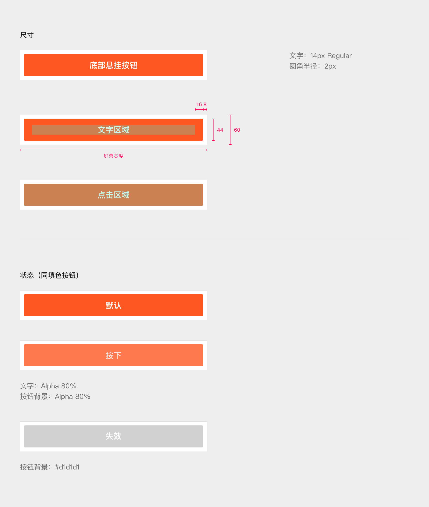

# 按钮

## 示例


这是一个示例的描述

## 填色按钮


* 按钮不支持换行
* 按钮不支持换行

1. 按钮不支持换行
2. 按钮不支持换行

## 线框按钮


* [ ] 这是一个 task
* [ ] task2

```bash
这是一段 code
这是一段 code
```

> 这是一个引用

| 表格试一下 |  |
| :--- | :--- |
| 内容1 | 内容2 |


提示信息




厉害了，还有标签



这个是另一个标签




## 底部悬挂按钮



## 文字按钮


```
$ give me super-powers
```


 Super-powers are granted randomly so please submit an issue if you're not happy with yours.


Once you're strong enough, save the world:


```bash
# Ain't no code for that yet, sorry
echo 'You got to trust me on this, I saved the world'
```



